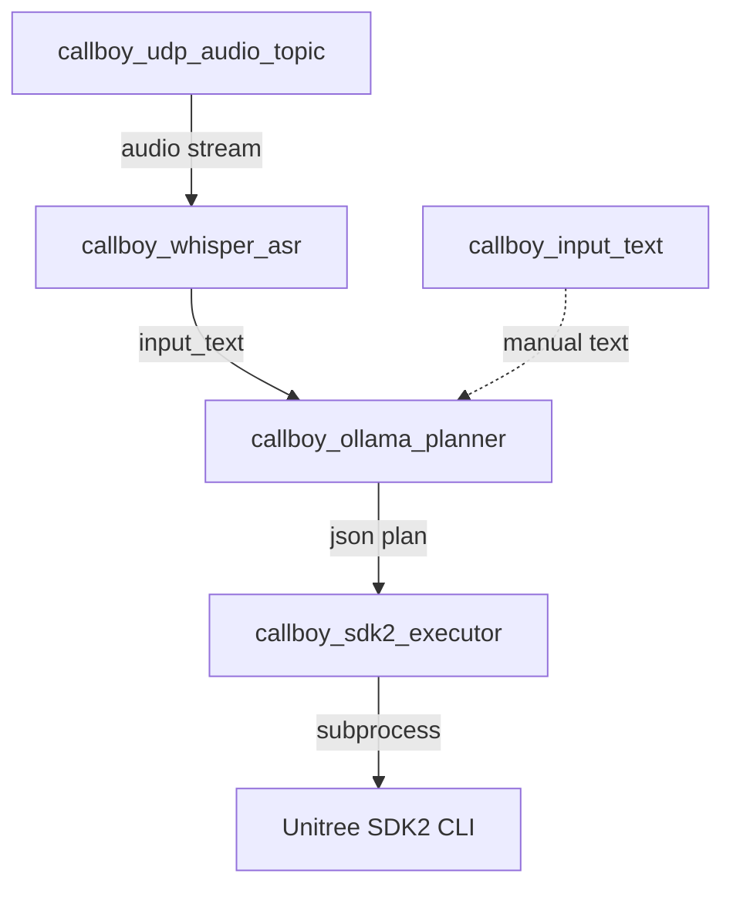

# callboy

ROS 2 (Python) pipeline for voice/text input → LLM planning (Ollama) → execution of Unitree SDK2 CLI commands (e.g. for Unitree G1).

The components are designed so that audio (PCM16) is fed into ROS 2 from a ROS topic or UDP multicast, then transcribed to text via ASR (Whisper). A planner node converts the text via Ollama into a **strict JSON** containing commands, and an executor node subsequently calls an SDK2 CLI (example binary) with appropriate flags.

## Architecture (Data Flow)



Standard flow in launch:

1. **Audio-In**: `callboy_udp_audio_topic`
   - UDP Multicast → ROS Topic `/g1/mics/pcm16` (`std_msgs/UInt8MultiArray`, PCM16 little-endian)
2. **ASR**: `callboy_whisper_asr`
   - `/g1/mics/pcm16` → `callboy/input_text` (`std_msgs/String`)
3. **Planner**: `callboy_ollama_planner`
   - `callboy/input_text` → `callboy/json` (`std_msgs/String`, JSON)
4. **Executor**: `callboy_sdk2_executor`
   - `callboy/json` → SDK2 CLI calls (subprocess)

## Workspace Structure

- `callboy.conf`: central configuration (default path expected by code; see below)
- `ros2_ws/`: ROS2 workspace
  - `src/callboy/`: ROS2 Python package `callboy`
    - `callboy/nodes/*`: ROS nodes
    - `launch/callboy.launch.py`: standard launch
    - `prompts/*`: prompt templates for the planner
  - `record_audio.py`: helper to record audio topic as WAV

## Prerequisites

- ROS 2 (with `rclpy`, `launch`, `launch_ros`)
- `colcon` build tools
- Python dependencies (at minimum):
  - `requests` (Planner → Ollama)
  - `faster-whisper` (Whisper ASR)
  - `numpy` (Whisper ASR processes PCM)
- Optional:
  - Local Ollama server (default: `http://localhost:11434`)
  - Unitree SDK2 example CLI binary (e.g. `g1_loco_client`)

Note: `setup.py` currently lists `faster-whisper` as `install_requires`. `numpy` is used in the Whisper node, so it should also be present in the environment.

## Build & Installation (ROS2)

Build in workspace:

```bash
cd ros2_ws
colcon build --symlink-install
source install/setup.bash
```

## Running

### 1) Quickstart via Launch

```bash
cd ros2_ws
source install/setup.bash
ros2 launch callboy callboy.launch.py
```

The launch file starts by default:

- `callboy_udp_audio_topic` (UDP → `/g1/mics/pcm16`)
- `callboy_whisper_asr` (ASR → `callboy/input_text`)
- `callboy_ollama_planner` (text → JSON)
- `callboy_sdk2_executor` (JSON → SDK2 CLI)

### 2) Text Input without ASR

Start nodes in a terminal (or adjust launch) and publish text:

```bash
cd ros2_ws
source install/setup.bash
ros2 run callboy callboy_input_text
```

Or once via parameter:

```bash
ros2 run callboy callboy_input_text --ros-args -p text:="wave hand" -p once:=true
```

### 3) Prepare Ollama

Ollama must be running and the model must be present:

```bash
ollama serve
ollama list
```

`callboy_ollama_planner` calls `POST {ollama_url}/api/generate`.

## Nodes in Detail

### `callboy_udp_audio_topic` (UDP → ROS2 Audio)

Publishes raw PCM byte stream as `std_msgs/UInt8MultiArray` on a topic (default: `/g1/mics/pcm16`).

Important parameters:

- `mcast_group` (default: `239.168.123.161`)
- `port` (default: `5555`)
- `local_ip` (default: `192.168.123.164`) – interface IP for IGMP join
- `topic` (default: `/g1/mics/pcm16`)
- `header_skip_bytes` (default: `0`) – if UDP payload has a header
- `channels` (default: `1`), `sample_width_bytes` (default: `2`) – metadata/layout
- `best_effort` (default: `true`) and `qos_depth`

### `callboy_whisper_asr` (Whisper ASR)

Subscribes to `whisper.input_topic` (default: `/g1/mics/pcm16`) and publishes recognized text on `whisper.output_topic` (default: `callboy/input_text`).

Features:

- RMS-based VAD (silence threshold + silence duration), followed by transcription.
- Optional wakeword: without wakeword, **nothing** is published to `callboy/input_text`.
- Model: `faster-whisper` (`WhisperModel`) – fallback to CPU `int8` on GPU error.

### `callboy_ollama_planner` (Text → JSON)

Subscribes to `callboy/input_text` and publishes `callboy/json`.

Important:

- Prompt from `planner.prompt_file` (default fallback: `prompts/default.txt`).
- Ollama call: `POST /api/generate` (non-streaming).
- Safety/normalization logic:
  - Reduced to a small **allowlist**: `set_velocity`, `shake_hand`, `wave_hand`, `wave_hand_with_turn`.
  - For `set_velocity`, a parameter is mandatory.
  - After each `set_velocity`, `stop_move` is automatically appended to the end of the plan.

Output format is a JSON object like:

```json
{"commands": [{"name": "set_velocity", "param": "0.3 0 0 2.0"}, {"name": "stop_move"}]}
```

### `callboy_sdk2_executor` (JSON → SDK2 CLI)

Subscribes to `callboy/json`, validates against `SUPPORTED_COMMANDS`, and executes commands sequentially.

Important parameters:

- `sdk2_cli_path` (from config) – must exist
- `network_interface`
- `dry_run` – does not execute subprocesses (returns `DRY_RUN`)
- `wait_for_velocity_duration` – if `set_velocity` is immediately followed by `stop_move`, the executor waits (based on the duration in the parameter) so that movement is visible

## Prompts

The prompt templates are located in `ros2_ws/src/callboy/prompts/`.

- `default.txt`: strict planner (German + English), defaults and mappings for movement
- `llama-3.1.txt`: alternative, shorter rules including degrees → time heuristic

## DDS / Transport Notes (optional)

### Recording Audio

`ros2_ws/record_audio.py` subscribes to `/g1/mics/pcm16` and writes `test_audio.wav` (16kHz, mono, 16-bit) after ~30 seconds.

Example:

```bash
cd ros2_ws
source install/setup.bash
python3 record_audio.py
```

### Inspecting Topics

```bash
ros2 topic list
ros2 topic echo /g1/mics/pcm16
ros2 topic echo callboy/input_text
ros2 topic echo callboy/json
```

## Troubleshooting

- **Config not found**: set `CALLBOY_CONFIG` to the repo's `callboy.conf`.
- **Planner reports "requests is missing"**: install `python3-requests` or `pip install requests`.
- **Whisper finds no publishers**: `callboy_udp_audio_topic` must be running and publishing to the correct topic (`/g1/mics/pcm16`).
- **VAD not triggering / triggering too often**: set `whisper.log_rms=true` in `callboy.conf` and adjust `whisper.silence_threshold`.
- **Executor executes nothing**: check `sdk2.cli_path` and if `sdk2.dry_run=true` is set.
- **Ollama timeout**: increase `callboy_ollama_planner` parameter `timeout_s`.
